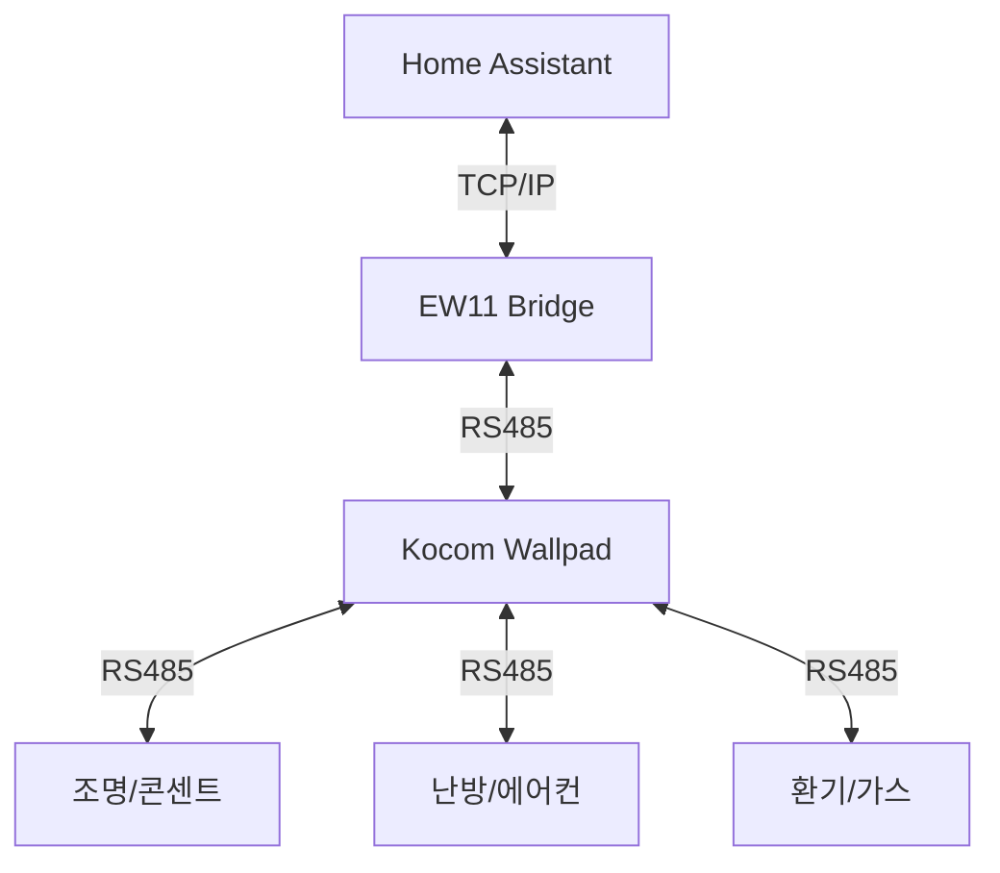

# Kocom Wallpad Integration for Home Assistant

[](https://github.com/hacs/integration)

Home Assistant를 위한 엔터프라이즈급 Kocom Wallpad 통합 구성요소입니다. RS485 통신을 통해 코콤 월패드 기기를 안정적으로 제어합니다.

## 시스템 아키텍처



## 설치 방법 (HACS)

1. **HACS** > **Integrations** > **Custom repositories** 메뉴로 이동합니다.
2. 이 저장소 URL을 입력하고 **Integration** 카테고리를 선택하여 추가합니다.
3. HACS 목록에서 `Kocom Wallpad`를 찾아 다운로드합니다.
4. Home Assistant를 재시작합니다.
5. **설정** > **기기 및 서비스** > **통합 구성요소 추가**에서 `Kocom Wallpad`를 검색하여 추가합니다.

## EW11 설정 가이드 (고급)

안정적인 통신을 위해 EW11 장치를 아래와 같이 설정하는 것을 권장합니다.

| 항목 | 설정값 | 비고 |
|------|--------|------|
| **Serial Settings** | | |
| Baud Rate | 9600 | |
| Data Bits | 8 | |
| Stop Bits | 1 | |
| Parity | None | |
| Flow Control | None | |
| **Network Settings** | | |
| Protocol | TCP Server | |
| Local Port | 8899 | |
| **Buffer Settings** | | (선택사항) |
| Buffer Size | 1024 | |
| Gap Time | 50ms | |

## 기능 및 지원 기기

| 기기 | 지원 여부 | 주요 기능 |
|------|-----------|-----------|
| 조명 (디밍 포함) | O | ON/OFF, 밝기 조절 |
| 콘센트 | O | ON/OFF, 전력 차단 |
| 난방 | O | 온도 설정, 외출 모드 |
| 에어컨 | O | 온도, 바람세기, 모드 |
| 환기 | O | 풍량, 프리셋, CO2 센서 |
| 가스 밸브 | O | 잠금 (열기 불가) |
| 엘리베이터 | O | 호출, 층수/방향 표시 |
| 모션 센서 | O | 현관 모션 감지 |
| 공기질 센서 | O | PM10, PM2.5, VOC 등 |

## 트러블슈팅 (Troubleshooting)

| 증상 | 원인 | 해결 방법 |
|------|------|-----------|
| **연결 실패** | IP/Port 설정 오류 | EW11의 IP와 Port(8899)가 정확한지 확인하세요. |
| **제어 안됨** | RS485 결선 불량 | A/B 선이 뒤바뀌지 않았는지 확인하세요. (A-A, B-B) |
| **센서 업데이트 느림** | 패킷 유실 | 공유기 성능 확인 및 EW11 전원 재인가를 시도하세요. |
| **진단 센서 에러 증가** | 노이즈/충돌 | 선로 점검 및 '자체 치유' 기능이 작동하는지 로그를 확인하세요. |

## 디버깅

문제 발생 시 `configuration.yaml`에 다음 내용을 추가하여 로그를 확보하세요.

```yaml
logger:
  default: info
  logs:
    custom_components.kocom_wallpad: debug
```

또한, **개발자 도구** > **서비스**에서 `kocom_wallpad.send_raw_command` 서비스를 통해 직접 패킷을 전송하여 테스트할 수 있습니다.

## 기여 및 라이선스

이 프로젝트는 [Apache License 2.0](./LICENSE)을 따릅니다.
문제가 발생하면 [Issues](https://github.com/lunDreame/kocom-wallpad/issues)에 제보해 주세요.
